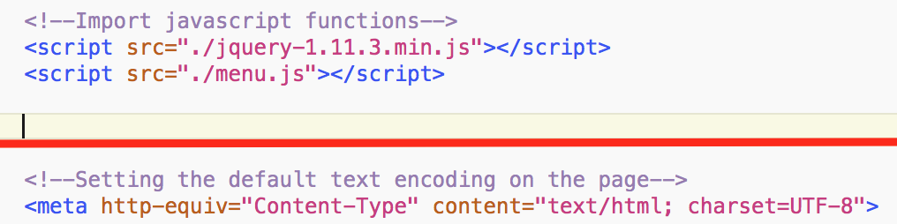

# CMPT104-Open-Source-Demo

1.  Open your browser and go to [github.com](http://github.com)

2.  Search for CMPT104 Open Source Demo

3.  Click on JYASKOWICH/CMPT104-Open-Source-Demo

4.  Press the green “Clone or download” button on the right side of the page

5.  Press the “Download ZIP” button

6.  Open your files and un-zip the .zip archive

## Part 2

1.  Go back to [github.com](http://github.com)

2.  Search for Cssnge

3.  Click on JYASKOWICH/CMPT104-Cssnge

4.  Download and unzip the archive

## Part 3

1.  Copy the cssnge.js file into the directory made from unzipping the CMPT104-Open-Source-Demo

2.  Right click the index.html file and open using a text editor (I recommend Notepad++ on Windows and TextWrangler on mac. Or if you have it Brackets. Any basic text editor will work)

3.  Add “``” to this line:

4.  Add “`<li><a onclick='toggleCSS("./main.css", "./alt.css")'<Toggle CSS</a<</li<`” to this line:

5.  Open index.html in a browser. The page should look something like this (try clicking the "Change CSS" button):

